# Database design

PostgreSQL 16, schema **`pmd`**, created by `drizzle/0015_product_master_platform.sql`. **27 tables** (one range-partitioned into 109 partitions), **2 views**, **4 functions** (one is the `updated_at` trigger), 3 explicit sequences plus the identity sequences, 83 indexes (not counting the per-partition copies of the price-history indexes), two extensions (`pg_trgm`, `btree_gin`). Nothing in the existing `public` schema was altered; the only coupling is `pmd.catalogue_link` (foreign keys to `public.products` and `public.users`).

The full field-by-field description of what leaves the database is in the [data dictionary](./DATA_DICTIONARY.md). This page explains the structure and the reasons for it.

## Entity model

```mermaid
erDiagram
    SOURCE ||--o{ INGESTION_RUN : "runs of"
    SOURCE ||--o{ PRODUCT_SOURCE : "listings from"
    INGESTION_RUN ||--o{ IMPORT_ERROR : "logs"
    PRODUCT_SOURCE ||--o| RAW_RECORD : "staged as"
    PRODUCT_MASTER ||--o{ PRODUCT_SOURCE : "seen in"
    PRODUCT_MASTER ||--o{ PRODUCT_IDENTIFIER : "identified by"
    PRODUCT_MASTER ||--o{ PRODUCT_SPECIFICATION : "described by (per source)"
    PRODUCT_MASTER ||--o{ PRODUCT_ATTRIBUTE_CONFLICT : "disagreements"
    PRODUCT_MASTER ||--o{ PRODUCT_IMAGE : "pictured by"
    PRODUCT_MASTER ||--o{ PRODUCT_CHANGE_LOG : "versioned by"
    PRODUCT_MASTER }o--o| PRODUCT_FAMILY : "pack sizes / variants of"
    PRODUCT_MASTER }o--o| BRAND : "sold as"
    PRODUCT_MASTER }o--o| MANUFACTURER : "made by"
    PRODUCT_MASTER }o--o| CATEGORY : "filed under"
    BRAND ||--o{ BRAND_ALIAS : "spellings"
    BRAND }o--o| MANUFACTURER : "owned by"
    MANUFACTURER ||--o{ MANUFACTURER_ALIAS : "spellings"
    CATEGORY ||--o{ CATEGORY : "parent of"
    CATEGORY ||--o{ CATEGORY_MAPPING : "mapped from source categories"
    PRODUCT_SOURCE ||--o{ PRODUCT_OFFER : "priced by seller"
    PRODUCT_OFFER ||--o{ PRICE_HISTORY : "observed over time"
    PRODUCT_SOURCE ||--o{ MATCH_CANDIDATE : "might be"
    PRODUCT_MASTER ||--o{ MATCH_CANDIDATE : "candidate"
    PRODUCT_MASTER ||--o{ PRODUCT_MERGE_LOG : "merged"
    PRODUCT_MASTER ||--o| CATALOGUE_LINK : "promoted to"
    CATALOGUE_LINK }o--|| PUBLIC_PRODUCTS : "GOKESARI_PRODUCT_CATALOG"
```

## Tables

| Group | Table | Rows are… | Notes |
|---|---|---|---|
| **Sources** | `source` | one per registered source | Status, legal basis, licence, trust weights, field mapping, credentials *name*. CHECK: `enabled` requires `status = 'ACTIVE'` |
| | `ingestion_run` | one per run | Counters, mode, status — the data-collection log |
| | `import_error` | one per unusable record or repaired value | Stage, severity, code, raw excerpt (personal data already stripped) |
| | `raw_record` | one per staged source payload | Sanitised JSON + content hash; the incremental "unchanged" shortcut reads it |
| **Product** | `product_master` | one per real-world product | 63 columns; generated `master_product_id`; `field_sources` records which source supplied each value; **no price column** |
| | `product_identifier` | one per identifier | GTIN, ISBN, MPN, model, SKU, source code, internal barcode; original form kept; check-digit result stored |
| | `product_family` | one per product line | Groups pack sizes / variants **without merging them** |
| | `product_image` | one per image URL | Referenced, never copied; licence note |
| **Facts** | `attribute_definition` | one per attribute | 81 registered keys: type, unit, group, authority (spec vs marketplace) |
| | `product_specification` | product × attribute × **source** | EAV; exactly one `is_preferred` per attribute per product |
| | `product_attribute_conflict` | one per disagreement | Both values and sources, status, resolution rule |
| **Reference** | `brand`, `brand_alias` | brands and every spelling | `brand_key` is the normalised identity |
| | `manufacturer`, `manufacturer_alias` | brand owners and spellings | Nothing invented — blank until a source supplies it |
| | `category` | 410 standard nodes, levels 1–5 | Materialised `path_names` / `path_ids` |
| | `category_mapping` | source category → standard category | `mapped_by` distinguishes system rules from manual overrides |
| **Commerce** | `product_source` | one per (source, source product id) | Provenance: method, dates, match status/score/rule, content hash; `product_id` is NULL while a record is held for review |
| | `product_offer` | one per (listing, seller) | **Current** state only |
| | `price_history` | one per observed change | Append-only; monthly range partitions |
| **Matching** | `match_candidate` | one per (listing, candidate master) | Score, status, relation, reasons, hard conflicts, review decision |
| | `product_merge_log` | one per merge | Who, when, why; merges are by pointer |
| **Governance** | `product_change_log` | one per field change | Version history with before/after and source |
| | `catalogue_link` | one per promoted product | The only bridge to `public.products` |
| **Operations** | `job` (+ `claim_job()`) | work queue | `FOR UPDATE SKIP LOCKED`; stale-claim recovery |
| | `dashboard_metric` | snapshot of dashboard numbers | Refreshed by `pmd.refresh_dashboard()` |
| | `reference_state` | one row: a fingerprint | Hash of the reference data defined in code (sources, taxonomy, attributes, shipped mappings). The runner re-syncs those tables **only when it differs** — 2 statements when nothing changed, instead of ~1,600 |
| **Views** | `v_product_flat`, `v_product_price_summary` | — | Feed the Excel PRODUCT_MASTER sheet; derived reference price columns |

## Key design choices

**Identifiers.** `MASTER_PRODUCT_ID` is generated in the database from `pmd.product_seq` (`GKS-PROD-` + 9 digits) so two processes can never mint the same id. GTIN is stored canonical (GTIN-14) with a **partial unique index over ACTIVE rows**: a retired (merged) master releases its GTIN to the survivor.

**Provenance on every fact.** `product_source` carries method and dates; `product_specification` is keyed by source; `product_master.field_sources` names the source of each master column; `product_change_log` records what changed and why. The brief's rule "product attributes can be traced to their source" is structural, not a convention.

**Missing is NULL.** The pipeline writes NULL for anything unknown — never `0`, `''` or a sentinel — and columns that would allow a meaningless value have CHECKs (`gst_rate_bp` 0–10000, HSN shape, quality 0–100…). The automated invariant `missing-is-null-not-zero` fails the run's checks if a zero quantity, weight or pack count, an empty name or a `-1` GST placeholder ever appears. The text `NOT_AVAILABLE` exists only in the Excel export.

**Money.** `bigint` minor units everywhere; `numeric(6,2)` only for percentages; currency is a column, not an assumption.

**No price on the product.** Two products at ₹100 and ₹110 are the same product; a price is a fact about a *seller at a moment*. `product_offer` holds now, `price_history` holds then.

**Constraints as guardrails.** 19 CHECKs on `product_master` (status vocabularies, GTIN shape, GST basis-point range, HSN shape, merge consistency `record_status = 'MERGED' ⇔ merged_into_product_id IS NOT NULL`, quality 0–100…), unique keys on every natural identity, and foreign keys throughout — the one deliberate exception is `product_change_log`, which has none so a change record can never block, or be cascaded away with, the thing it describes.

## Indexes (the ones that matter)

| Purpose | Index |
|---|---|
| Exact identifier match | `product_master_gtin_uq` — unique, partial (`gtin IS NOT NULL AND record_status = 'ACTIVE'`); `product_identifier_global_uq (id_type, id_value) WHERE id_type IN ('GTIN','ISBN')` — a GTIN or ISBN belongs to exactly one product |
| MPN / model within a brand | `(brand_id, mpn)` and `(brand_id, model_number)`, both partial on NOT NULL |
| Pack-size siblings | `(brand_id, normalized_name)` btree |
| Fuzzy candidate retrieval | composite GIN `(brand_id, normalized_name gin_trgm_ops)` (brand-scoped) and on `search_text` (brand-less) |
| Keyword search | GIN on `to_tsvector('simple', search_text)` |
| Keyset listing | primary key order; partial indexes on status and quality for ACTIVE rows; brand+category, category, family, manufacturer |
| One preferred value | `product_specification_preferred_uq (product_id, attribute_key) WHERE is_preferred` |
| Price history | per partition: `(product_id, collected_at DESC)`, `(offer_id, collected_at DESC)`, BRIN on `collected_at` |
| Current offers | `product_offer (product_id) WHERE is_current` |
| Review queue | `match_candidate (review_status, match_status) WHERE review_status = 'PENDING'` |
| Held records | `product_source (resolution) WHERE resolution = 'PENDING_REVIEW'` |
| Work queue | `job (priority, run_after, job_id) WHERE status = 'PENDING'` |

## Scale

Measured on a **1,000,000-row synthetic master** on a laptop-class local PostgreSQL 16 (table 289 MB, indexes 487 MB; see the [pilot report](./PILOT_REPORT.md#scale-benchmark-1000000-synthetic-masters) for method and caveats):

| Operation | Median |
|---|---|
| GTIN lookup | 0.1 ms |
| Brand-scoped trigram candidate retrieval | 8 ms |
| Sibling lookup | 0.2 ms |
| Keyword search over the whole master | 20 ms |
| Fuzzy search over the whole master | 16 ms |
| List page 1 / page 900,000 (keyset) | 2.3 ms / 2.2 ms |
| Dashboard snapshot refresh | 5.4 s (runs after a batch, not per request) |

Every plan was an index scan. **Storage at 10M** extrapolates linearly to roughly 2.9 GB of table and 4.9 GB of indexes for the master alone. Treat that as a floor, not a forecast: the synthetic rows fill few of the 63 columns (real rows carry descriptions, dimensions, tax fields), the specification, source, offer and image tables are additional and larger than the master, and index build time and cache hit rate depend on the hardware.

**Price history** is the fastest-growing table. Monthly partitions (2022-01 → 2030-12 pre-created, extended by every run) keep each partition's index small and make retention a `DROP`/`DETACH` of one partition. Rows are written only on change.

**Partition maintenance:** `pmd.ensure_price_history_partitions(from, to)` is called at the start of every run; a default partition catches anything outside the range so an insert can never fail for want of a partition.

## Migration and rollback

`0015` is purely additive: it creates the `pmd` schema (and the `pg_trgm` extension if it is missing) and alters nothing that exists. To undo it: `scripts/pmd/rollback-0015.sql` drops **only** the `pmd` schema and the migration's bookkeeping row. That is destructive — take a backup first. See the [deployment guide](./DEPLOYMENT.md).

## Retention and privacy

* No personal data is collected; contributor usernames and proof references are stripped by each adapter before storage.
* `raw_record` payloads are sanitised copies kept for reprocessing and audit; they can be truncated per source without touching the master.
* `product_change_log` and `price_history` are append-only by design; retention is by partition or by date range, decided by the business, not by the code.
