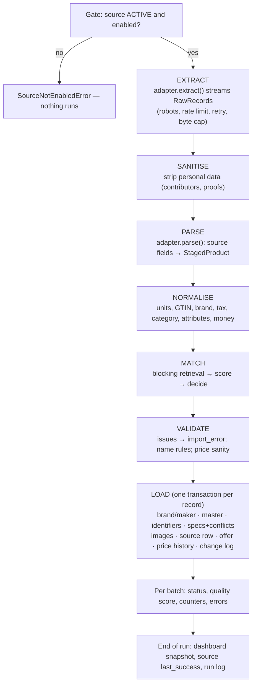

# ETL pipeline

**Extract → Parse → Normalise → Match → Validate → Load**, run by `runIngestion()` (`src/server/pmd/pipeline/run.ts`) once per source per run.

## 0. Gate

First, reference data is made current — the source register, taxonomy, attribute registry and shipped category mappings are defined in code and synced to the database **only if their fingerprint differs** from the one last applied (two statements when nothing changed; a full sync only after the definitions change).

Then `pmd.source.status` must be `ACTIVE` and `enabled`. Marketplaces, government portals with CAPTCHA and GS1 are registered as `BLOCKED_*` and are refused here whatever code exists.

## 1. Extract

An adapter yields `RawRecord`s from an async generator, so a 1.3 GB dump is never loaded: the Open Food Facts adapter streams the gzip TSV, filters to a country, and **aborts the transfer** the moment its row limit is reached (the pilot read 229 MB of a 1.3 GB file). HTTP goes through `PoliteHttpClient` only — robots.txt fail-closed, per-redirect re-check, per-host rate limit, exponential backoff with jitter and `Retry-After`, a byte cap, a header timeout plus an idle timeout (a fixed total timeout would kill a healthy long download).

## 2. Sanitise

`adapter.sanitize()` removes personal data before *anything* is stored or logged. The platform collects product facts, not people.

## 3. Parse

`adapter.parse()` is a pure function from the source's fields to a `StagedProduct` (one vocabulary for every source). It throws `ParseError(code, message, severity)`; a policy skip (a per-kilogram price is not a pack price) is a `WARNING`, an unusable record an `ERROR`.

## 4. Normalise

`normalizeStaged()` is pure and returns a `NormalizedProduct` plus a list of issues; nothing throws for a bad field.

| Field | Rule |
|---|---|
| Text | NFKC, Latin accents folded (Indic scripts preserved), apostrophes dropped, `&`→`and`, thousands separators removed |
| Pack size | `1 kg` = `1000 g` = `1,000 grams` → `1000 g`; multipacks keep size and count (`6 x 200 ml`); a *title* is parsed more strictly than a quantity field (`5G` is a network, `2 in 1` is not two inches) |
| GTIN | Any of EAN-8/UPC-A/EAN-13/GTIN-14 → GTIN-14; check digit; restricted ranges; ISBN-10 → ISBN-13 |
| Brand | `Samsung` / `SAMSUNG` / `Samsung India` / `Samsung India Pvt. Ltd.` → one key; every spelling kept as an alias; a company-like second brand becomes the manufacturer |
| Category | Source category → standard category (`category_mapping` plus manual overrides); unmapped → NULL, never a guess |
| Tax | GST → basis points, slab status CURRENT/LEGACY/UNUSUAL (data-driven); HSN 4/6/8 digits in a goods chapter; FSSAI 14 digits |
| Money | Integer minor units; `price > MRP` flagged (Legal Metrology) but kept |
| Missing | `NULL` — never `0`, never `''` |

## 5. Match

See [DEDUPLICATION.md](./DEDUPLICATION.md). Read-only apart from the decision it returns.

## 6. Validate

Issues become `import_error` rows (`ERROR` = not loaded, `WARNING` = loaded but repaired or suspicious). Records with no usable name are rejected — unless they carry a valid GTIN of a product we already know, in which case they enrich it (e.g. a price-only record).

## 7. Load

One transaction per record, advisory-locked per brand.

| Situation | Result |
|---|---|
| New product | INSERT master + identifiers + specs + images + source row (+ offer + history) |
| Same content as last time | Only `last_seen` moves (`UNCHANGED`) — the incremental fast path |
| Existing product, new facts | UPDATE by survivorship: fill blanks; replace only if this source outranks the one that supplied the value; every change → `product_change_log`, version +1 |
| Price / MRP / stock changed | `price_history` row + offer updated; the product is untouched |
| New seller | New offer row |
| Older observation than current | Never rolls the current price back; backfills history once |
| Spec disagrees with another source | `product_attribute_conflict`; winner by precedence; equal → OPEN, value in force does not flip |
| Absent from a *complete* snapshot | Offer `is_current = false`, status `TEMPORARILY_UNAVAILABLE` — never `DISCONTINUED` |

## Initial full load vs daily incremental

Same code path. The first run finds everything new; later runs hit the unchanged fast path for untouched records and write history only for what changed. `run_mode` (`PILOT`, `INITIAL_FULL`, `INCREMENTAL`, `IMPORT`, `BACKFILL`) is recorded; only `INITIAL_FULL`/`INCREMENTAL` runs over a **complete** source may conclude "not seen".

## After each batch and at run end

Status and quality score recomputed for touched products; counters saved; at run end the dashboard snapshot is refreshed, the source's `last_success_at` set, and the run finalised as `SUCCEEDED`, `PARTIAL` (some errors) or `FAILED`.
