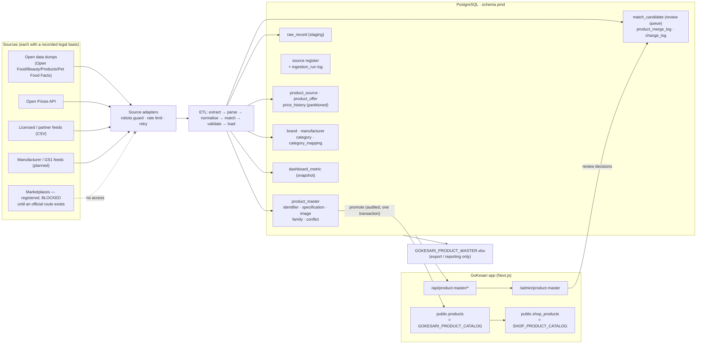

# Software Architecture Document — Product Master Data Platform

*Status: pilot implemented and validated. Sections marked **(designed, not yet exercised)** describe capacity the design supports but that has not been load-tested beyond the figures in [PILOT_REPORT.md](./PILOT_REPORT.md).*

## 1. Purpose

Gokesari needs one reliable, normalised catalogue of the products that exist in the market — with brand, manufacturer, category, specifications, identifiers, sellers and prices kept **separate** — so that shop owners pick an existing product instead of typing it again, and so that data quality is measurable. The platform collects from lawful sources, normalises, matches and de-duplicates, scores quality, and feeds the marketplace catalogue.

It is a **data platform, not a scraper**: there is no code anywhere that fetches from a marketplace.

## 2. Context

ASCII fallback: `sources → adapters (robots · rate limit · retry) → ETL (extract, parse, normalise, match, validate, load) → pmd.* tables → { API + dashboard | Excel export | promotion → public.products → public.shop_products }`.

## 3. Component map

| Layer | Location | Responsibility |
|---|---|---|
| Schema | `drizzle/0015_product_master_platform.sql` | The whole `pmd` schema: tables, indexes, partitions, generated ids, queue function, dashboard function |
| Config | `src/server/pmd/config.ts` | Every threshold, weight, source-kind default and GST slab — no magic numbers in algorithms |
| Normalisation | `src/server/pmd/normalize/*` | Pure functions: text, units and packs, GTIN/ISBN, brand, tax, colour/size/country, money |
| Taxonomy | `src/server/pmd/taxonomy/*` | 5-level category outline, attribute registry, source-category mapper |
| Matching | `src/server/pmd/match/score.ts` (pure), `engine.ts` (candidate retrieval) | Four match levels, hard conflicts, decision policy |
| Sources | `src/server/pmd/sources/*` | Adapter contract, robots.txt guard, polite HTTP client, streaming CSV parser, adapters, source register |
| Pipeline | `src/server/pmd/pipeline/*` | Run orchestrator, per-record loader, specifications/conflicts, offers/price history, quality scoring, review/merge, automated checks |
| Services | `src/server/pmd/services/*` | Read models (list, search, detail…), import/match/validate, catalogue bridge |
| API | `src/app/api/product-master/**` | Thin route handlers (parse → authorise → service → respond), like the rest of the app |
| UI | `src/app/admin/product-master`, `src/components/pmd-review-queue.tsx` | Quality dashboard and review queue |
| Export | `src/server/pmd/export/*` | Workbook model (single source for sheets, formats and the data dictionary) and builder |
| Tooling | `scripts/pmd/*` | Local database, sample acquisition, pilot run, checks, export, benchmark |

## 4. Key architecture decisions

**AD-1 — A separate `pmd` schema, linked to the live catalogue by one table.**
The marketplace already has an operational master (`products`, `shop_products`, price/stock, MRP history). The universal product master is a different thing: multi-source, up to tens of millions of rows, with provenance on every fact. Putting 10M rows into `products` would swamp catalogue queries that shop owners run all day, and would force every source quirk into the operational schema. So the platform lives in its own schema in the **same PostgreSQL**, and `pmd.catalogue_link` (FK → `public.products`) is the only coupling. No existing table was altered; the migration is additive and reversible (`scripts/pmd/rollback-0015.sql`).
*Rejected:* extending `products` (bloat, blast radius); a separate database (loses the atomic promotion transaction and cross-schema FK).

**AD-2 — TypeScript inside the existing repo, plain SQL through postgres.js.**
Same runtime, test runner (Vitest against real PostgreSQL), Excel library (ExcelJS) and CI as the app. The pipeline is set-based and batch-oriented (upserts, `ON CONFLICT`, trigram retrieval), which is what SQL is for, so it does not go through an ORM row-at-a-time; Drizzle stays the app's ORM.
*Rejected:* a separate Python service (a second deployment stack, duplicated auth/audit, no shared tests).

**AD-3 — Hand-written migration.**
Partitioned tables, trigram GIN indexes, generated identifiers and SQL functions are not expressible in Drizzle's schema DSL. Precedent exists in the repo (`0001`, `0003`).

**AD-4 — Identity is layered, and a mismatch is a review, not a merge.**
GTIN is stored canonically as GTIN-14 (EAN-13, UPC-A and GTIN-8 zero-padded) — GoKesari's existing `products.gtin` stores digits as scanned and would treat a UPC-A and its EAN-13 as different. A code drives a match only if its check digit is valid and it is not in a restricted-circulation range (in-store, coupon, serial). Even then, a GTIN that contradicts brand or pack size becomes `NEEDS_REVIEW` (crowdsourced barcodes are frequently wrong). See [DEDUPLICATION.md](./DEDUPLICATION.md).

**AD-5 — Facts are stored per source; the master shows the winner, never the only value.**
Every category-specific attribute is one row per product × attribute × source. Disagreement writes `product_attribute_conflict`; the better-precedence source (manufacturer > GS1 > government > licensed feed > marketplace > open data) wins the preferred flag and the rule is recorded; equally authoritative sources leave the conflict OPEN and the value in force does not flip.

**AD-6 — Prices are not product attributes.**
`product_master` has no price or MRP column (asserted by a test and an automated check). Offers hold current seller state; `price_history` (monthly range partitions) is append-only and written on first sighting and on every change. Marketplace prices never become GoKesari's MRP: the bridge copies an MRP only from a source entitled to verify it, and lands it as `PENDING_VERIFICATION`.

**AD-7 — Compliance is enforced by construction, not by convention.**
The source register (`pmd.source`) records status and legal basis for every source the brief names. The runner refuses any source that is not `ACTIVE` and enabled; the database itself forbids `enabled` on a non-`ACTIVE` source. Every HTTP request goes through one client that obeys robots.txt (fail-closed), re-checks it on every redirect, rate-limits per host, and identifies itself with a contact. There is no CAPTCHA handling, header spoofing or proxy rotation anywhere.

**AD-8 — Excel is an export, not a store.**
A worksheet holds 1,048,576 rows; the platform is designed for 10M products. Export is range-partitioned into part files, and refuses to run if the database violates its own invariants.

## 5. Scalability design

| Concern | Mechanism |
|---|---|
| Candidate matching at 10M rows | **Blocking**, never all-pairs: unique GTIN index; brand-scoped MPN/model index; `(brand_id, normalized_name)` btree for pack siblings; GIN trigram on `normalized_name` (brand-scoped) and `search_text` (brand-less). The scorer then runs on ≤ 15 candidates |
| Price history volume | Monthly range partitions (pre-created 2022-01 → 2030-12; extended by every run), BRIN on time, `(product_id, collected_at)` btree; rows written only on change |
| Listing / export | Keyset pagination on `product_id` (no OFFSET); partitioned export |
| Dashboard at 10M | `dashboard_metric` snapshot refreshed after each batch — page loads are O(1) |
| Concurrency | Per-record transaction with a per-brand advisory lock (workers cannot both create the same product); unique-index race is retried into a link; `pmd.job` + `claim_job()` (`FOR UPDATE SKIP LOCKED`) is the queue |
| Memory | Adapters are async generators; batches are bounded (default 500); the 1.3 GB source dump is streamed and aborted early, never loaded |
| Retry | Transient PostgreSQL errors (deadlock, serialisation, connection) retried with backoff; HTTP retries with jitter and `Retry-After` |

Measured figures (1,000,000-row master) are in [PILOT_REPORT.md](./PILOT_REPORT.md). **(designed, not yet exercised)** at 10M: the same index-backed access paths apply; the two costs that grow are the dashboard refresh (full aggregates — run per batch, not per request) and bulk index build on first load (mitigation: load first, index after, or `CREATE INDEX CONCURRENTLY`).

## 6. Security and privacy

* **Authorisation:** four permissions (`pmd:view`, `pmd:review`, `pmd:promote`, `pmd:import`) in the app's existing capability matrix. Operators view, review, promote; only admins bulk-import. Shop owners and customers have no access to the master — shops use the existing catalogue search.
* **No personal data collected:** contributor usernames and proof references are stripped by each adapter *before* raw storage or error logging.
* **Secrets:** a source stores only the *name* of the environment variable holding its credentials.
* **Write safety:** every CLI refuses to run against a non-local host unless `PMD_ALLOW_REMOTE=1`, and never falls back to `DATABASE_URL` (which in a developer `.env` points at a hosted database).
* **Input validation:** Zod schemas with `strict()` reject unknown keys; identifiers in routes are validated against `GKS-PROD-#########`; search text never reaches SQL or `tsquery` unescaped (tested).
* **Auditability:** human actions (promote, review decision, import) write to the app's `audit_logs`; the promotion writes its audit row in the same transaction as the catalogue insert.

## 7. Observability

`ingestion_run` (the data-collection log: source, mode, counters, timestamps), `import_error` (every unusable record and every repaired value, with stage and severity), `product_change_log` (field-level version history), `product_merge_log`, the quality dashboard, and `scripts/pmd/checks.ts` — eleven SQL invariants that must be zero and five steward queues.

## 8. Failure modes

| Failure | Behaviour |
|---|---|
| A bad record | Logged to `import_error`; the run continues; run status `PARTIAL` |
| A source stops answering / robots.txt unreachable | HTTP client fails closed; the run fails with a clear error; nothing partial is marked missing |
| Source drops products | Only after a **complete** snapshot, offers are marked not current and status becomes `TEMPORARILY_UNAVAILABLE` — never `DISCONTINUED` |
| Two workers create one GTIN | Advisory lock, then unique index; the loser retries and links |
| Migration must be undone | `scripts/pmd/rollback-0015.sql` (drops only `pmd`) |
| Wrong merge | Merges are by pointer; history, identifiers and both sources' facts are kept |

## 9. Known limitations

* Only open-data sources have working adapters today; marketplaces, GS1, FSSAI, GST, BIS are registered with their lawful route but **cannot yet collect** (they need agreements, licences or official APIs).
* Category coverage of the pilot is limited to what open data offers (see the pilot report); phones, laptops, apparel, automotive and tools need licensed or manufacturer feeds.
* Crowdsourced brand fields sometimes hold company names ("HUL", "Unilever"); the review checks list them, and a steward-maintained alias table is the fix.
* Matching is rule- and similarity-based; it is deliberately conservative, so it queues more than an ML matcher would. Its thresholds are configuration.
